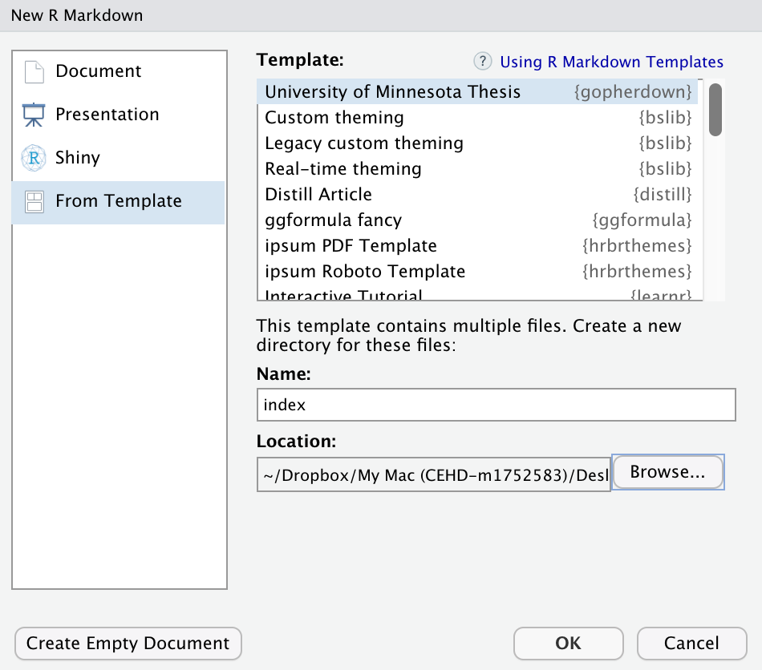

# gopherdown

This project is a modified version Chester Ismay’s
[thesisdown](https://github.com/ismayc/thesisdown) package to provide
support for the University of Minnesota’s thesis.

Currently, the PDF version is fully functional. All other versions are
derived from thesisdown and are not guaranteed to work.

## Installation

To install and use `{gopherdown}` and use it for your
dissertation/thesis, you will need:

-   [pandoc \>= 2.16.2](http://pandoc.org/)
-   [LaTeX dsitribution](https://yihui.org/tinytex/) specifically XeTeX;
-   [R \>= 3.3.0](https://r-project.org)
-   [RStudio](https://rstudio.org) (optional, but it helps)

Rather than installing a large TeX distribution, I recommend installing
LaTeX via the `install_tinytex()` function from the R package
[`{tinytex}`](https://yihui.org/tinytex/).

``` r
# Install tinytex package
install.packages('tinytex')

# Install LaTeX
tinytex::install_tinytex()
```

Once you have pandoc and LaTeX installed, you can install and use
`{gopherdown}`. Open Rstudio and type:

``` r
if (!require("devtools")) install.packages("devtools", repos = "http://cran.rstudio.org")
devtools::install_github("zief0002/gopherdown")
```

To use `{gopherdown}`, open Rstudio, click on **File \> New File \>
Rmarkdown …** and then select the **University of Minnesota Thesis**
from the **Templates**.



Make sure to give your thesis the name `index` and save it to the
correct path. (This will ensure that the main RMD document will be
called `index.Rmd`.) You can rename the directory (i.e., folder), but if
you rename the main RMD document, you will also need to open
`_bookdown.yml` and edit the first Rmd file (`index.Rmd`) to change its
name to what ever you named the main document.

``` diff
book_filename: "thesis"
chapter_name: "Chapter "
rmd_files: [
  "my-project-name.Rmd",
  
  "chapters/01-chap1.Rmd",
  "chapters/02-chap2.Rmd",
  "chapters/03-chap3.Rmd",
  "chapters/04-chap4.Rmd",
  "chapters/05-chap5.Rmd",
  
  "chapters/90-references.Rmd",
  "chapters/91-appendix1.Rmd",
  "chapters/92-appendix2.Rmd"
  ]
download: [
  ["thesis.pdf", "PDF"]
  ]
```

**Note the remainder of this document will assume that document is named
`index.Rmd`.**

## Rendering

To render your thesis, you can open `index.Rmd` in RStudio and then hit
the “knit” button. Alternatively, you can use:

``` r
rmarkdown::render("index.Rmd")
```

Your thesis will be deposited in the `_book/` directory.

## Components

The following components are ones you should edit to customize your
thesis:

### \_bookdown.yml

This is the main configuration file for your thesis. Arrange the order
of your chapters in this file and ensure that the names match the names
in your folders.

### index.Rmd

This file contains all the meta information that goes at the beginning
of your document. Currently, we have the introduction in there, but you
can leave that part blank if you wish.

### pre/

This folder contains all of the Rmd files to be included in the
frontmatter of your dissertation (e.g. abstract, acknowledgements, and
dedication).

There is a slight caveat to all of these files: the very first line must
be plain text or the rendering will be screwed up.

### chapters/

This folder contains the Rmd files for each chapter in your
dissertation, including the appendices. Modify as you will.

### bib/

Store your bibliography (as bibtex (`.bib`) files) here.

### csl/

Specific style files for bibliographies should be stored here. A good
source for citation styles is
<https://github.com/citation-style-language/styles#readme>

### figure/ and data/

These should be self explanatory. Store your figures and data here and
reference them in your document.

## Helpful Documents

There are several resources online to help you with RMarkdown. The OG
is:

-   [R Markdown Cookbook](https://bookdown.org/yihui/rmarkdown-cookbook)
